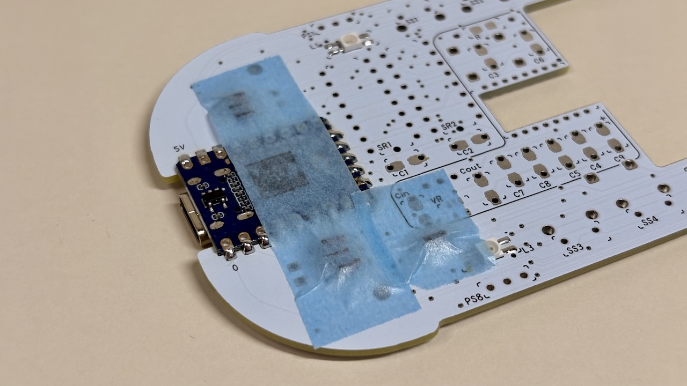
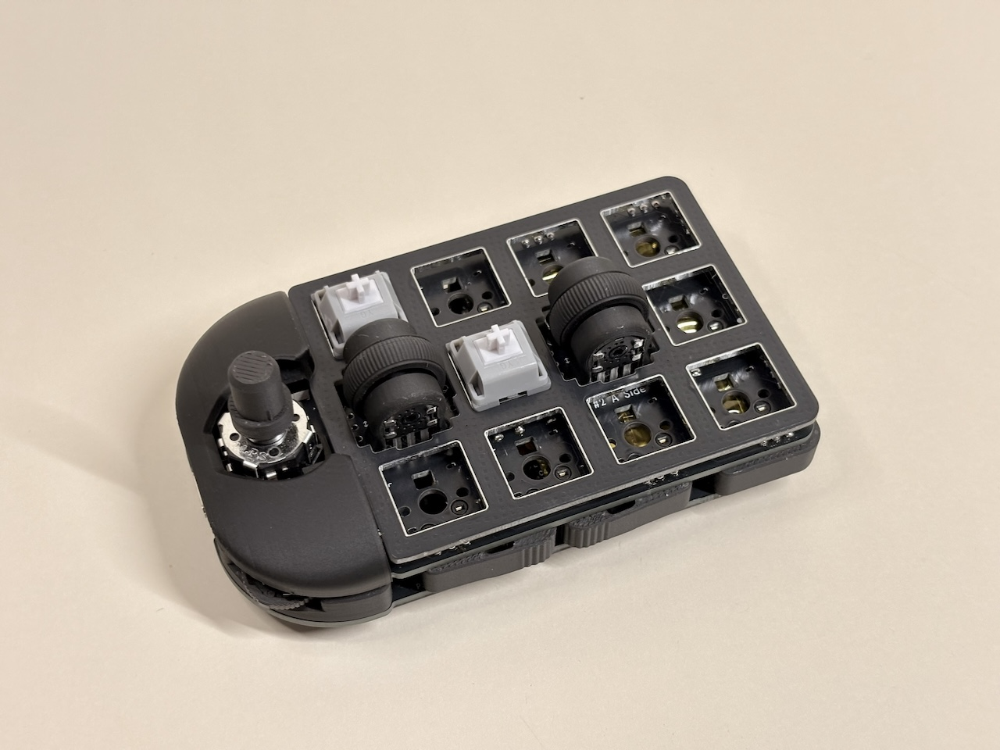

# Cannonball LL Build Manual (wireless version) ([日本語](https://note.com/taro_hayashi/n/n1ee5ece46387))

  

## 1 Introduction

### 1.1 Attention

- Lithium polymer batteries can explode and cause injury or fire, so handle them with care when in use.
- You create the firmware yourself. The ZMK Firmware, which serves as a template, is available to the public.
  - https://github.com/Taro-Hayashi/zmk-config-th/tree/Cannonball-LL
- It is assumed that the user has some familiarity with soldering.

### 1.2 Contents

  
  

|     | Types                  | Quantities |               |
| --- | ---------------------- | ---------- | ------------- |
| 1   | PCB                    | 1          |               |
| 2   | Runner I               | 1          |               |
| 3   | Runner II              | 1          |               |
| 4   | Top cover              | 1          |               |
| 5   | Knob cover             | 1          |               |
| 6   | Short screws           | 2          | M2 6mm        |
| 7   | Long screws            | 4          | M2 10mm       |
| 8   | Nuts                   | 4          | M2            |
| 9   | Insert nuts            | 2          | M2 5mm or 6mm |
| 10  | Diodes                 | 24         | 1N4148        |
| 11  | Capacitors             | 2          | 0.1uF         |
| 12  | Shift registers        | 2          | 74HC595       |
| 13  | back buttons           | 3          | 3x6x4.3       |
| 14  | Side buttons           | 4          | 3x6x5         |
| 15  | Slide switch           | 1          | SK12F14       |
| 16  | Mouse buttons          | 2          | YD-003        |
| 17  | Lever buttons          | 2          | THMU27        |
| 18  | Rotary Encoder         | 1          | RKJXT1F42001  |
| 19  | Rubber feet            | 5          |               |
| 20  | Pin header             | 1          | 40pins        |
| 21  | Pin Sockets            | 2          | 14pins        |
| 22  | Hotswap Sockets        | 10         | CPG151101S11  |
| 23  | 1U Wheel Encoder       | 2          | THQWGD001C    |
| 24  | Micro Controller Board | 1          | RP2040-Zero   |

### 1.3 Additional required
  

| Types              | Quantities  |
| ---------------- | --- |
| Keyswitches      | 10  |
| Keycaps          | 10  |
| XIAO BLE | 1   |
| Lead wire | 1   |
| LiPo battery | 1   |
| Protective tape, rubber sheeting, etc.
 | 1   |

### 1.4 Further additional required to a wireless mouse
Capacitors and resistors are available in leaded or 1206 and 0805 packages.
The regulator can be TO92 or SOT23-5. The image shows the sensor set on BOOTH.

  

|    | Types    | Quantities  |                  | 
| -------- | ------- | --- | ---------------- | 
|          | Sensor & lens    | 1   | PMW3610          | 
| VR       | Regulator | 1   |  3.3V input 1.8 or 1.9V output  |
| C3、C4、C5 | Capacitor  | 3   | 0.1uF X7R        |
| C6、C7    |         | 2   | 0.01uF X7R       | 
| C8       |         | 1   | 10uF X7R         | 
| C9       |         | 1   | 3.3uF 16V        | 
| C in     |         | 1   | input capacitor      |
| C out    |         | 1   | output capacitor      | 
| R        | Resistor      | 1   | 10kΩ             |        
|          | Mouse sole  | 5   | 0.65mm and 0.8mm thickness confirmed|        

### 1.5 Optional

| Types                    | Quantitie  |                                                                                             |
| ---------------------- | --- | --------------------------------------------------------------------------------------------- |
| PH connector Post Side type 2P | For use with batteries with PH connector. Be sure to check the plus and minus. It must be a smaller size or there may be interference.
 |
| Choc V1/V2 keyswitches | 10  | Height can be reduced. Sockets and top plates are not used. It cannot coexist with MX switches.                                   |
| Tape or glue           | 1   | When using Choc switches, isolate the head of the pin header to prevent unexpected operation. |
| [3-keys blocker](stl/)           | 1   | Blocks the palm of the hand when held. |
| [Switch plate](stl/)           | 1   | 3DP switch plate with invisible pin header heads. |

### 1.6 Tools required
  

| Types                                                | 
| --------------------------------------------------- |
| Soldering iron                                               |
| Trowel                     |
| Soldering wire |
| Nipper                     | 
| Cutter                    |
| File                      | 
| Twezers                    |   
| screwdriver                 | 

### 1.7 Tools optional

| Types                               | 
| --------------------------------- | 
| C-type trowel tip                             | 
| flux|                    |
| IPA                               | 
| Heat-resistant mat                             | 
| Multimater                              |
| Desoldering wire                         | 
| Design Knife                           |
| Masking tape                          | 

## 2 Preparation for assembly

### 2.1 Disconnect the mainboard

It can be split cleanly by cutting a slit with a cutter and bending it.
  
The tabs are cut away with nippers and the cut surfaces are sanded. Be careful not to remove the original board edges, as over-shaving will damage the circuitry.
  
This area can be left jagged without affecting the finished form.
  
It could be divided into three parts: main board #1, main board #2 and switch plate.
  

### 2.2 Remove parts from the runner

Runner I has 3 components and runner II has 17 components.
  

### 2.3 Remove the shift register and rotary encoder from the case

The shift register is pressed from the back with the runner II component (leverage). Be careful not to prick your finger with the pin.  
For the rotary encoder, cut the left and right claws with nippers.
  

### 2.4 Write test firmware

Download the uf2 file here.

- [Cannonball_LL-seeeduino_xiao_ble-zmk.uf2](https://github.com/Taro-Hayashi/Cannonball-LL/releases/download/0.28.2/Cannonball_LL-seeeduino_xiao_ble-zmk.uf2)

Once the XIAO BLE is connected to the PC via the USB cable, press the small reset button twice quickly.
    
Drag and drop the uf2 file as it is recognised as a XIAO-SENSE drive.  
    
It will now be recognised as a keyboard.

### 2.5 Press fitting of insert nuts

Press-fit the insert nut into the printed item in the image. Main board #1 is also used.
  
Apply main board #1 to the backside and press the soldering iron onto the insert nut.
  
Ensure as few steps as possible with main board #1.
  
Cut out the reinforcement with nippers.
  

## 3 Soldering of main board #️1

- The pin headers that may come with the XIAO BLE are thinner than those included and should be discarded to avoid confusion.
- In this build manual, priority is given to checking the operation, and the mouse-ising components are put off until later, but it is easier to solder from the shortest components first.

### 3.1 Be careful when soldering

Imagine molten solder spreading only on the pad due to surface tension. It is very easy to apply flux.
  
Heat the pads and component legs well to allow electricity to pass through both the board and the components.  
Be careful that the solder does not connect with the small holes (VIA).
  
Take care that the legs coming out of the through-hole component are around 2 mm; if they exceed 2.5 mm, they may interfere with the 3D printed item on the bottom.  
It is easier to fix them with masking tape after insertion and soldering.
  
Also, the melting point of 3D printed products is around 200°C. Be careful not to melt the soldering iron if it comes into direct contact with it.

### 3.2 Soldering XIAO BLE

5 V (VUSB), solder the device in the GP0 position, making sure it is on the reverse side.
  
Wire the RESET (1) and BAT+ (2) pads on the back.  
Be careful not to pull on the wiring material or consider not soldering the RESET pad, as if it is stripped, the reset button will also be unusable (resetting with the rear button will not be possible).
  
(Optional) If you want to convert it to a mouse, you can also wire two NFC's.
  
Take care not to interfere with runner I components.
  

### 3.3 Soldering of diodes and shift registers

Solder D1 to D7, SR1 and SR2 using the marks as landmarks.
  

### 3.4 Soldering of capacitors

Solder to C1 and C2, marked 104. The ones in the sensor set are slightly smaller and have different characteristics, so be careful not to make a mistake.
  

### 3.5 Soldering side buttons and slide switches

Plug and solder the four side buttons SS1 to SS4 and one slide switch to SL.
  

### 3.6 Soldering of back buttons

The back button is inserted from the backside.
  

### 3.7 Confirmation of operation

Connect to a PC with a USB cable and check the operation of the side buttons and two of the rear buttons in a row.
  
Press the remaining rear button twice quickly to make sure the XIAO-SENSE drive comes out. This is used for firmware updates.
  
After checking, disconnect the cable. The slide switch is used to switch the battery on and off.

### 3.8 (Optional) Soldering of components for mouseisation

Solder the regulator to VR, capacitors C3 to C9, Cin, Cout and resistor R in the white box.
  
The 3.3uF 16V capacitor on C9 has polarity, so check it before soldering.
  
The regulator of the sensor set is flat side down.
  
Lead-type components are laid down after soldering.
  
Solder the sensor. Align the silk print with the small mark.
  
Remove the sticker from the back, place the lens on it and melt the surface foot to lightly fix it in place.
  
  
Match the runner I components and connect them to the PC to check that the sensor responds.
  
If it does not work, check that the condenser is not wrong or that the legs are not bridged.
Be careful not to damage the lens while working.

### 3.9 Soldering of pin sockets

Cut out eight pin sockets and pin headers with three pins each.
  
Insert the short end of the pin header into the pin socket and place the pin socket side on main board #1.
  
Insert the six Runner II components. If they are difficult to insert, shave off the cut marks on the pin headers or pin sockets.
  
Cover the main board #2 with the pin headers (do not solder yet). If it is difficult to get all the pin headers through, force a few at a time to avoid rubbing the board.
  
Once flipped over, solder the pin socket to main board #1.
  
After soldering is complete, return to the front and remove main board #2.  
Printed items do not need to be removed.
  
If mainboard #2 has been soldered in place, use leverage to remove it. Be aware that if the pin header is bent, it may cause poor contact, so pull it out vertically.
  
If a multimater is available, check that there is continuity between the XIAO BLE, the shift register GPIO and the pin headers.
  

### 3.10 Battery soldering

Ensure that the slide switch is in the same condition as in the picture and solder the battery.
  
Make sure to check + and -. After soldering is finished, turn the slide switch on and check that it can be connected to a Bluetooth-enabled device.
  
If you have connection difficulties even though the system is activated, reset the system once with this firmware and then re-install the test firmware.

- [settings_reset-seeeduino_xiao_ble-zmk.uf2](https://github.com/Taro-Hayashi/Cannonball-LL/releases/download/0.28.2/settings_reset-seeeduino_xiao_ble-zmk.uf2)
  
## 3.11 Assembling the lower half

Weld the part for the RP2040-Zero reset button in the small hole in the runner I component.
  
Combine the parts of runner I and place five parts of runner II. Pay attention to the orientation of the central component.
  
The corner of the button stopper to be placed here interferes, so it is cut at a slight angle with nippers.
  
Place mainboard #1 on top and fit a nut on one of the corner components of runner I.
  
A total of 9 runner I components and 4 nuts were fitted with long screws.
  
Attach the mouse sole to the back and store in a safe place.
  

## 4 Soldering of mainboard #2

### 4.1 Soldering of diodes

Solder D8 to D24; from D19 onwards the mounting surface is different.
  
  

### 4.2  Soldering of MX sockets

Solder from S1 to S10.
  

### 4.3  Soldering of lever buttons

Attach to L1 and L2. Solder the contacts on the sides as well.
  

### 4.4 Soldering of mouse buttons

Attach to M1 and M2. Align the click bar with the silk print.
  

### 4.5 Assembling the 1U wheel encoder

The following components of the sachet are used.
  

|     | Types        | Quantities|               |
| --- | ---------- | --- | ------------- |
| 1   | Wheel       | 2   |               |
| 2   | Shaft       | 2   |               |
| 3   | Spacer      | 2   |               |
| 4   | Base        | 2   |               |
| 5   | Cover        | 2   |               |
| 6   | Wheel Encoder | 2   | 6x6x7         |
| 7   | tactile Button    | 2   | 11mm          |
| 8   | Short screws    | 4   | M2 5mm or 6mm |
| 9   | Nut        | 4   | M2            |

Solder the tactile button and wheel encoder to E1 and E2 in the orientation chosen. The build guide uses the orientation shown in the image.
  
Insert the shaft from the flat side of the wheel.
  
Attach the wheel to the encoder. Ensure that the hexagonal holes align with the hexagonal shaft.
  
Fit the spacer and place it on the tactile button.
  
Attach the base with screws and nuts.
  
Install the cover.
  

### 4.6 Soldering rotary encoders

Solder to ST.
  

### 4.7 Installing the top cover

Attach from the rear side with short screws.
  
Ensure that the mouse buttons are clickable.
  

### 4.8 Soldering of pin headers

Check the orientation and soldering of the components on main board #2 again.
Protect the area on the back of mainboard #2 where the battery hits with tape or a rubber sheet.
  
Place on mainboard #1 and solder the pin headers.
  
Working one by one, starting with the corner pin headers, while trying to reduce the gaps as much as possible, will produce a clean result.

### 4.9 Checking the operation

Attach the shaft from Runner I to the rotary encoder.
  
Connect to a PC to check operation. Check the operation of the socket with one of the keyswitches. Be careful not to break the leg of the keyswitch.
  
After checking operation, disconnect the USB cable.

### 4.10 Installing the switch plate
Align the switch plate with main board #2 and install the keyswitch.
  
The keycap and knob cover are completed when fitted.
  

My ZMK repository is here.
- https://github.com/Taro-Hayashi/zmk-config-th/tree/Cannonball-LL

## 5 Misc

### 5.1 Maintenance

If the knob becomes loose or the 1U wheel encoder cover comes off easily, it can be adjusted and fixed by melting it with a soldering iron.  
If the top and bottom fastenings become loose or poor contact, consider replacing the pin headers and pin sockets.

### 5.2 About unused pads

These pads are connected to the LEDs and the centre push.
  

### 5.3 Data for printing

- [stl](/stl)

Optional or colour-changed parts can be printed.
    
  
### 5.5 Thanks

I referred to snize([@snize](https://x.com/snize))'s SEIBOKU for the selection of components and the firmware code.

- https://github.com/snize/BOB-PMW3610-SEIBOKU
  
### 5.6 Sales website

- BOOTH - [https://tarohayashi.booth.pm/items/6736492](https://tarohayashi.booth.pm/items/6736492)

