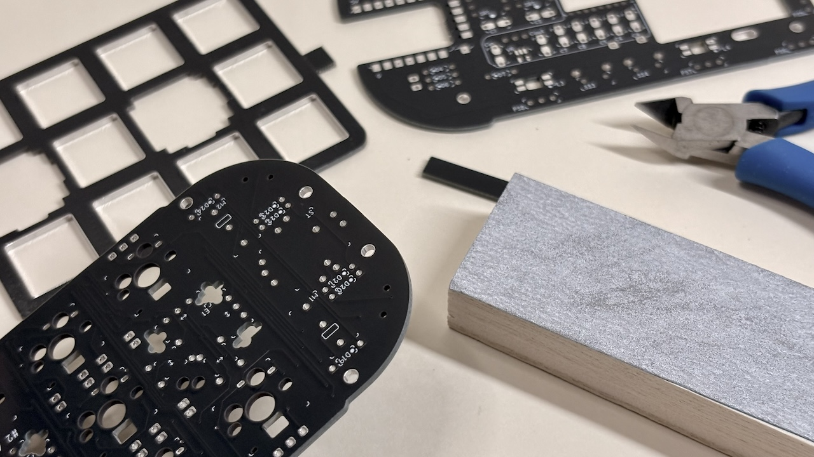
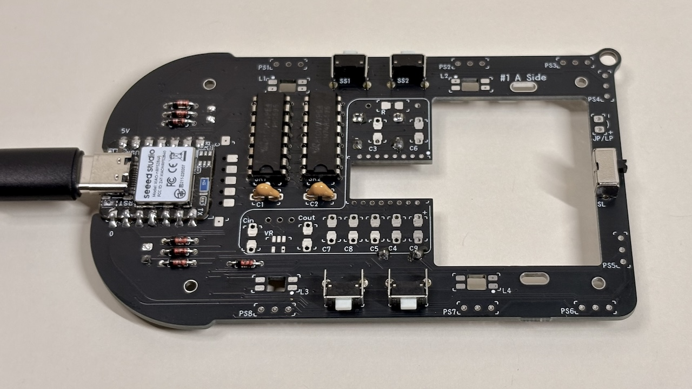
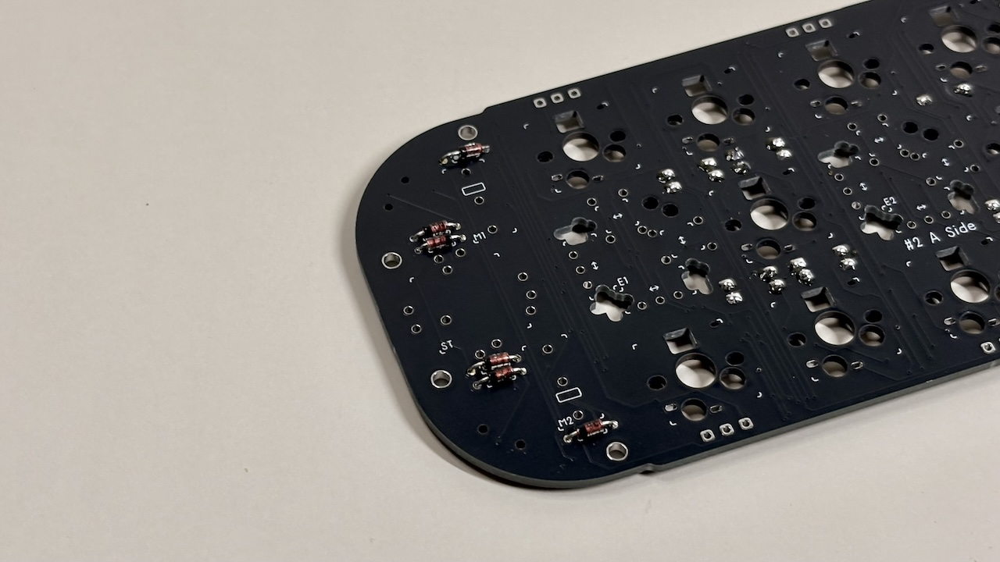
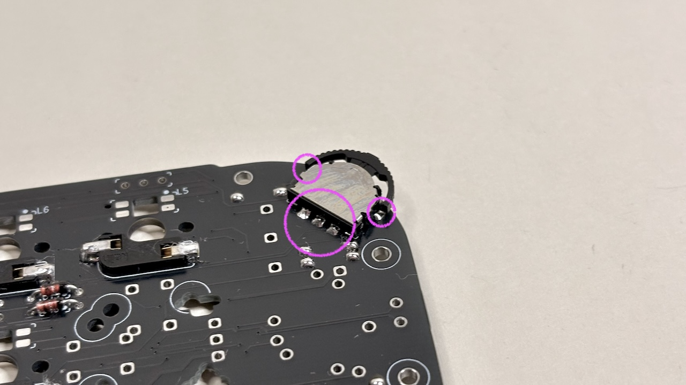

# Cannonball LL Build Manual (wireless version) ([日本語](https://note.com/taro_hayashi/n/n3da1e116aa8d))

## 1 Introduction

### 1.1 Attention

- Lithium polymer batteries can explode and cause injury or fire, so handle them with care when in use.
- You create the firmware yourself. The ZMK Firmware, which serves as a template, is available to the public.
  - https://github.com/Taro-Hayashi/zmk-config-th/tree/Cannonball-LL
- It is assumed that the user has some familiarity with soldering.

### 1.2 Contents

|     | Types                  | Quantities |               |
| --- | ---------------------- | ---------- | ------------- |
| 1   | PCB                    | 1          |               |
| 2   | Runner I               | 1          |               |
| 3   | Runner II              | 1          |               |
| 4   | Top cover              | 1          |               |
| 5   | Knob cover             | 1          |               |
| 6   | Short screws           | 2          | M2 6mm        |
| 7   | Long screws            | 4          | M2 10mm       |
| 8   | Nuts                   | 4          | M2            |
| 9   | Insert nuts            | 2          | M2 5mm or 6mm |
| 10  | Diodes                 | 24         | 1N4148        |
| 11  | Capacitors             | 2          | 0.1uF         |
| 12  | Shift registers        | 2          | 74HC595       |
| 13  | back buttons           | 3          | 3x6x4.3       |
| 14  | Side buttons           | 4          | 3x6x5         |
| 15  | Slide switch           | 1          | SK12F14       |
| 16  | Mouse buttons          | 2          | YD-003        |
| 17  | Lever buttons          | 2          | THMU27        |
| 18  | Rotary Encoder         | 1          | RKJXT1F42001  |
| 19  | Rubber feet            | 5          |               |
| 20  | Pin header             | 1          | 40pins        |
| 21  | Pin Sockets            | 2          | 14pins        |
| 22  | Hotswap Sockets        | 10         | CPG151101S11  |
| 23  | 1U Wheel Encoder       | 2          | THQWGD001C    |
| 24  | Micro Controller Board | 1          | RP2040-Zero   |

### 1.2 Additional required

| Types              | Quantities  |
| ---------------- | --- |
| Keyswitches      | 10  |
| Keycaps          | 10  |
| XIAO BLE | 1   |
| Lead wire | 1   |
| LiPo battery | 1   |
| Protective tape, rubber sheeting, etc.
 | 1   |

### 1.3 Further additional required to a wireless mouse
Capacitors and resistors are available in leaded or 1206 and 0805 packages.
The regulator can be TO92 or SOT23-5. The image shows the sensor set on BOOTH.

|    | Types    | Quantities  |                  |                                                              |
| -------- | ------- | --- | ---------------- | 
|          | Sensor & lens    | 1   | PMW3610          | 
| VR       | Regulator | 1   |  3.3V input 1.8~1.9V output  |
| C3、C4、C5 | Capacitor  | 3   | 0.1uF X7R        |
| C6、C7    |         | 2   | 0.01uF X7R       | 
| C8       |         | 1   | 10uF X7R         | 
| C9       |         | 1   | 3.3uF 16V        | 
| C in     |         | 1   | レギュレーターの入力用      |
| C out    |         | 1   | レギュレーターの出力用      | 
| R        | Resistor      | 1   | 10kΩ             |        
|          | Mouse sole  | 5   | 0.65mm〜0.8mm thickness|        

### 1.3 対応しているもの

| 部品名                 |                                                                  |
| ------------------- | ---------------------------------------------------------------- |
| PHコネクター ポスト サイド型 2P | PHコネクター付きのバッテリーに使用します。プラスマイナスを必ず調べてください。小さめのサイズでないと干渉する可能性があります。 |
| Choc V1/V2互換のキースイッチ | 高さを抑えることができます。MX互換のキースイッチとの共存はできません。ソケット、トッププレートは使いません。          |
| 絶縁できるテープ、接着剤等       | Chocスイッチを使う場合はピンヘッダの頭を絶縁すると予期しない動作を防ぐことができます。                    |

### 1.4 必要な道具

| 道具名     |                   |
| ------- | ----------------- |
| はんだごて   |                   |
| こて台     |                   |
| はんだ     | 鉛入りが扱いやすいです       |
| ニッパー    |                   |
| カッター    |                   |
| やすり     | 棒、もしくは240番程度の紙やすり |
| ピンセット   |                   |
| 精密ドライバー | 00番か0番のプラスドライバー   |

### 1.5 あると便利な道具

| 道具名      | 備考                                                                   |
| -------- | -------------------------------------------------------------------- |
| C型のこて先   | 細かいはんだ付けに向いた先端です。お持ちのはんだごてに対応したものを購入してください。                          |
| フラックス    | はんだ付けの難易度が著しく下がります。粘り気が強く電気を通さないので端子やスイッチに入らないように使います。可燃性。           |
| IPA      | フラックスを拭き取るのに使います。掃除にも使えます。油分を飛ばすためスイッチ等潤滑油が使用されてるものに付かないように使います。可燃性。 |
| 耐熱マット    | 同上                                                                   |
| テスター     | はんだ付けや部品の故障の確認ができます。                                                 |
| 小皿       | 部品をなくしにくくなります。                                                       |
| 当て木      | 紙やすりを使う場合に平面を出しやすくなります。                                              |
| はんだ吸い取り線 | 失敗した際に部品を取り外しやすくなります。                                                |
| デザインナイフ  | プリント品の細かい修正等に使えます。                                                   |
| マスキングテープ | パーツの固定に使います。                                                         |

## 2 組み立ての準備

### 2.1 メインボードを切り離す
カッターで切れ目を入れて曲げると綺麗に割ることができます。

タブはニッパーで切り離し、切断面をやすりがけします。削りすぎると回路を傷つけるので元々の基板端は削らないように気をつけます。

ここはギザギザのままでも見えなくなります。

メインボード#1、メインボード#2、スイッチプレートの3つに分割できました。

### 2.2ランナーから部品を外す
ランナーIには部品が3つ、ランナーIIには部品が17個付いています。

### 2.3 シフトレジスターとロータリーエンコーダーをケースから外す
シフトレジスターはランナーIIの部品（テコ）で裏から押します。ピンで指を刺さないよう気をつけます。
ロータリーエンコーダーは左右の爪をニッパーで切ります。

### 2.4 テストファームウェアを書き込む
こちらのuf2ファイルをダウンロードしてください。
- [Cannonball_LL-seeeduino_xiao_ble-zmk.uf2](https://github.com/Taro-Hayashi/Cannonball-LL/releases/download/0.28.2/Cannonball_LL-seeeduino_xiao_ble-zmk.uf2)

XIAO BLEをUSBケーブルでPCに接続したら小さなリセットボタンを2回素早く押します。

XIAO-SENSEドライブとして認識されるのでuf2ファイルをドラッグ&ドロップします。

これでキーボードとして認識されるようになります。
### 2.5 インサートナットの圧入
画像のプリント品にインサートナットを圧入します。メインボード#1も使用します。

メインボード#1を裏面に当て、インサートナットにはんだごてを押し付けます。

メインボード#1と出来るだけ段差がないようにします。

補強材をニッパーで切り取ります。

## 3 メインボード#️1のはんだ付け
- XIAO BLEに付属することがあるピンヘッダは同梱のものより細いため、混同しないように捨ててください。
- この組み立て方では動作確認を優先してマウス化の部品を後回しにしていますが、はんだ付けは背の低い部品から行う方が楽です。
### 3.1 はんだ付けで気を付けること
表面張力でパッドの上だけに溶けたはんだが広がるのをイメージします。フラックスを塗るととても簡単になります。

パッドや部品の足をよく熱して基板と部品両方に電気が通るようにします。
はんだが小さい穴（VIA）と繋がってしまわないように気をつけてください。

スルーホールの部品から出る足は2mm程度になるように気をつけます。2.5mmを超えると底面の3Dプリント品と干渉することがあります。
差し込んだ後にマスキングテープで固定してはんだ付けをすると楽になります。

また、3Dプリント品の融点は200度前後です。直接はんだごてが当たると溶けてしまうので気をつけます。

### 3.2 XIAO BLEのはんだ付け
5V（VUSB)、GP0の位置で裏表を確認してはんだ付けします。

裏面のRESET（1）とBAT+（2）のパッドを配線します。
RESETのパッドは剥がれるとリセットボタンも使えなくなってしまうので配線材を引っ張らないように気をつけるか、はんだ付けしないことも検討してください（背面ボタンでのリセットはできなくなります）。

（オプション）マウス化する場合はNFCの二つも配線します。

ランナーIの部品と干渉しないように気をつけます。

### 3.3 ダイオード、シフトレジスターのはんだ付け
D1からD7、SR1、SR2にマークを目印にしてはんだ付けします。

### 3.4 コンデンサーのはんだ付け
C1とC2にはんだ付けします。104と書いてあります。センサーセットのものは少し小さく特性が違うので間違えないように気をつけます。

### 3.5 側面ボタンとスライドスイッチのはんだ付け
側面ボタン4つをSS1からSS4に、スライドスイッチ1つをSLに差し込んではんだ付けします。

### 3.6 背面ボタンのはんだ付け
背面ボタンは裏側から差し込みます。

### 3.7 動作の確認
USBケーブルでPCに接続して側面ボタンと、背面ボタンのうち並んだ2つの動作を確認します。

残りの背面ボタンを2回すばやく押してXIAO-SENSEドライブが出てくることを確認します。ファームウェアの更新の際に使います。

確認をしたらケーブルを外します。スライドスイッチはバッテリーのオンオフに使われます。
### 3.8  （オプション）マウス化用部品のはんだ付け
白枠内にレギュレーターをVR、コンデンサーをC3からC9、Cin、Cout、抵抗をRにはんだ付けします。

C9の3.3uF 16Vのコンデンサーには極性があるので確認してからはんだ付けします。

センサーセットのレギュレーターは平面が下になります。

リードタイプの部品ははんだ付けの後に寝かせます。

センサーをはんだ付けします。シルク印刷と小さいマークを合わせます。

裏面のシールを剥がしてレンズをのせ、表面の足を溶かして軽く固定します。

ランナーIの部品を合わせてPCに接続して、センサーに反応があることを確認します。

動かない場合はコンデンサーが間違っていたり足がブリッジしていないか確認してみてください。
作業中はレンズを傷つけないように気をつけます。
### 3.9 ピンソケットのはんだ付け
ピンソケット、ピンヘッダーを3ピンずつ8つ切り出します。

ピンソケットにピンヘッダーの短い方を差し込んで、ピンソケット側をメインボード#1に配置します。

ランナーIIの部品を6つ差し込みます。入りにくい場合はピンヘッダーやピンソケットの切れ跡を削ってください。

メインボード#2をピンヘッダーに合わせてかぶせます（まだはんだ付けしません）。全てのピンヘッダーを通すのが難しい時は無理をして基板を擦らないように数個ずつにします。

裏返したらメインボード#1にピンソケットをはんだ付けします。

はんだ付けが終わったら表に戻してメインボード#2を外します。
プリント品を外す必要はありません。

メインボード#2をはんだ付けしてしまっていた場合はテコを使って外してください。ピンヘッダが曲がると接触不良の原因となるため垂直に引き抜くことを意識してください。

テスターがある場合はXIAO BLE、シフトレジスターのGPIOとピンヘッダーが導通していることを確認します。

### 3.10 バッテリーのはんだ付け
スライドスイッチが画像と同じ状態になっていることを確認してバッテリーをはんだ付けします。

必ず＋と−を確認してください。はんだ付けが終わったらスライドスイッチをオンにしてBluetooth対応機器と接続できるか確かめます。

起動しているのに接続に難がある場合は一度こちらのファームウェアでリセットしてからテストファームウェアを入れ直してください。
- [settings_reset-seeeduino_xiao_ble-zmk.uf2](https://github.com/Taro-Hayashi/Cannonball-LL/releases/download/0.28.2/settings_reset-seeeduino_xiao_ble-zmk.uf2)
## 3.11 下半分の組み立て
ランナーIの部品の小さな穴にRP2040-Zeroのリセットボタン用パーツを溶接します。

ランナーIの部品を組み合わせ、ランナーIIの部品を5個置きます。中央の部品の向きに気をつけます。

ここに乗せるボタンのストッパーの角が干渉するのでニッパーで少し斜めに切ります。

上からメインボード#1を置き、ランナーIの角の部品の一つにナットを取り付けます。

合計9個のランナーIの部品と4つのナットを取り付けました。

裏面にマウスソールを貼り、安全な場所に保管します。

## 4 メインボード#2のはんだ付け

### 4.1 ダイオードのはんだ付け
D8からD24までをはんだ付けします。D19以降は取り付ける面が違います。

### 4.2 MXソケットのはんだ付け
S1からS10まではんだ付けします。

### 4.3  レバーボタンのはんだ付け
L1、L2に取り付けます。側面にも接点があるのではんだ付けします。

### 4.4 マウスボタンのはんだ付け
M1、M2に取り付けます。クリックバーの位置をシルク印刷に合わせます。

### 4.5  1Uホイールエンコーダーの組み立て
小袋の部品のうち以下のものを使用します。

|     | 部品名        | 個数  |               |
| --- | ---------- | --- | ------------- |
| 1   | ホイール       | 2   |               |
| 2   | シャフト       | 2   |               |
| 3   | スペーサー      | 2   |               |
| 4   | ベース        | 2   |               |
| 5   | カバー        | 2   |               |
| 6   | ホイールエンコーダー | 2   | 6x6x7         |
| 7   | クリックボタン    | 2   | 11mm          |
| 8   | ネジ（小）      | 4   | M2 5mm or 6mm |
| 9   | ナット        | 4   | M2            |

E1とE2に、方向を選んでクリックボタンとホイールエンコーダーをはんだ付けします。ビルドガイドでは画像の向きにしました。

ホイールの平らな面からシャフトを差し込みます。

エンコーダーにホイールを取り付けます。六角形の穴と六角形の軸が合うようにします。

スペーサーを取り付けてタクトスイッチに乗せます。

ベースをネジとナットで取り付けます。

カバーを取り付けます。

### 4.6 ロータリーエンコーダーのはんだ付け
STにはんだ付けします。

### 4.7 トップカバーの取り付け
裏面からネジ（短）で取り付けます。

マウスボタンがクリック可能なことを確認します。

### 4.8 ピンヘッダのはんだ付け
改めてメインボード#2の部品の向き、はんだ付けの状態を確認します。
メインボード#2の裏面の、バッテリーが当たる部分をテープやゴムシートなどで保護します。

メインボード#1に乗せてピンヘッダをはんだ付けします。

隙間をできるだけ減らすようにしながら角のピンヘッダから一つずつ作業をすると綺麗に出来上がります。
### 4.9 動作確認
ロータリーエンコーダーにランナーIについていたシャフトを取り付けます。

USBケーブルでPCに接続して動作を確認します。キースイッチを一つ使ってソケットの動作を確認していきます。キースイッチの足が折れないように気をつけてください。

動作を確認したらUSBケーブルを取り外します。
### 4.10 スイッチプレートを取り付ける
メインボード#2とスイッチプレートの位置を合わせてキースイッチを取り付けてゆきます。

キーキャップとノブカバーを取り付けたら完成です。

ZMKのリポジトリはこちらです。
- https://github.com/Taro-Hayashi/zmk-config-th/tree/Cannonball-LL

## 5 Misc

### 5.1 Maintenance

If the knob becomes loose or the 1U wheel encoder cover comes off easily, it can be adjusted and fixed by melting it with a soldering iron.
If the top and bottom fastenings become loose or poor contact, consider replacing the pin headers and pin sockets.

### 5.2 About unused pads

これらのパッドはLEDとセンタープッシュに繋がっています。

### 5.3 Data for printing

- [stl](/stl)

Optional or colour-changed parts can be printed.
  
  
### 5.5 Thanks

I referred to snize([@snize](https://x.com/snize))'s SEIBOKU for the selection of components and the firmware code.

- https://github.com/snize/BOB-PMW3610-SEIBOKU
  
### 5.6 Sales website

- BOOTH - [https://tarohayashi.booth.pm/items/6736492](https://tarohayashi.booth.pm/items/6736492)

