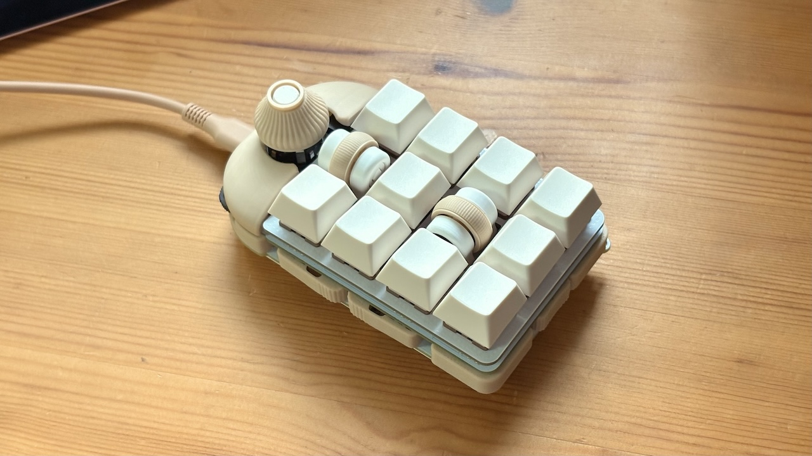
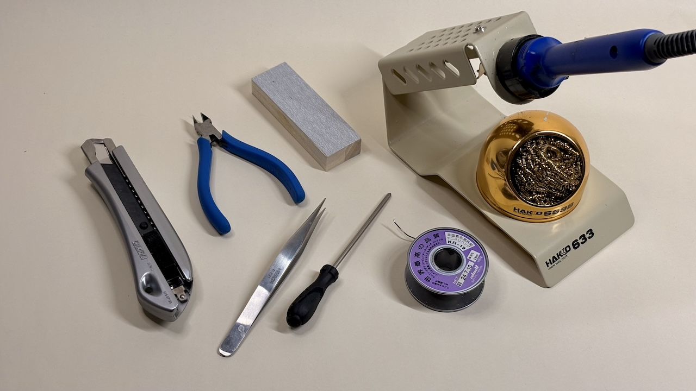
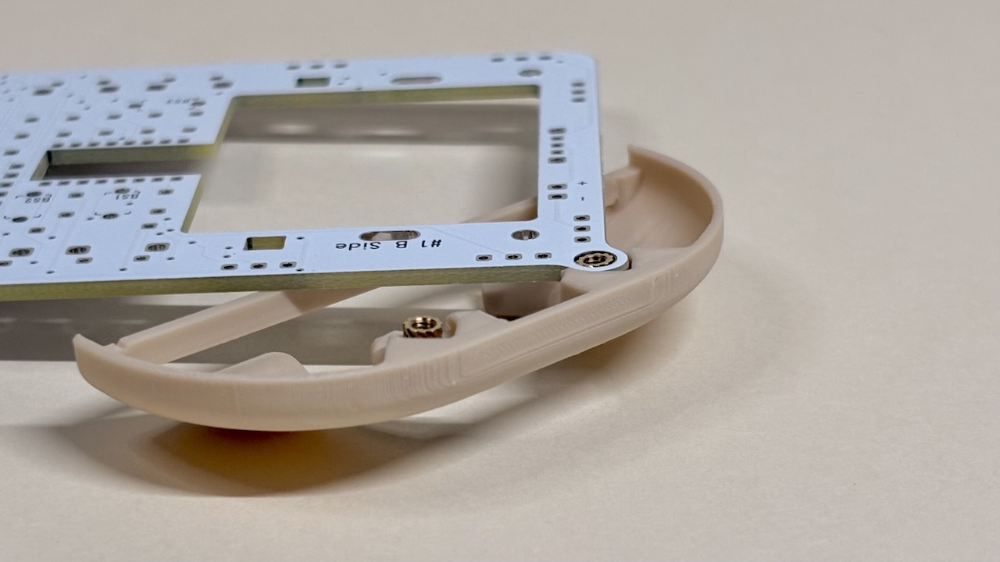
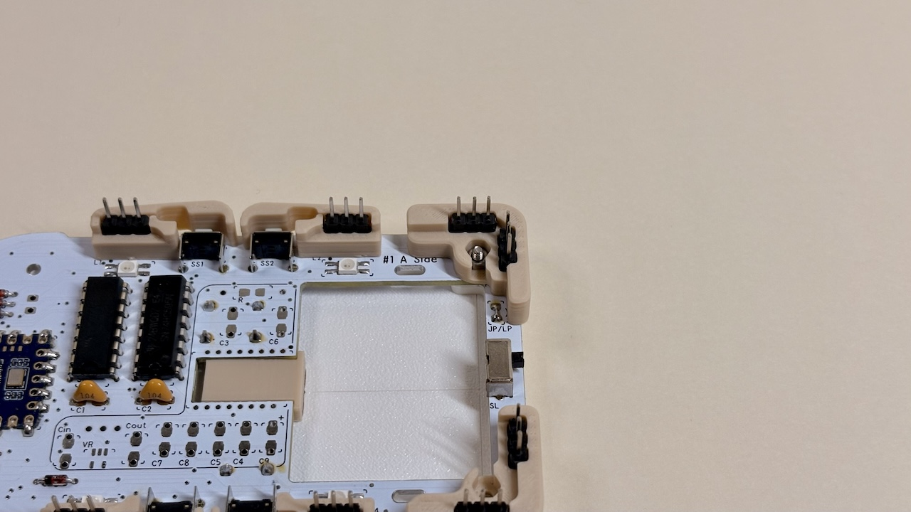

# Cannonball LL Build Manual ([日本語](https://note.com/taro_hayashi/n/n3da1e116aa8d))

  

## 1 Introduction

### 1.1 Contents

  
  

|     | Types                  | Quantities |               |
| --- | ---------------------- | ---------- | ------------- |
| 1   | PCB                    | 1          |               |
| 2   | Runner I               | 1          |               |
| 3   | Runner II              | 1          |               |
| 4   | Top cover              | 1          |               |
| 5   | Knob cover             | 1          |               |
| 6   | Short screws           | 2          | M2 6mm        |
| 7   | Long screws            | 4          | M2 10mm       |
| 8   | Nuts                   | 4          | M2            |
| 9   | Insert nuts            | 2          | M2 5mm or 6mm |
| 10  | Diodes                 | 24         | 1N4148        |
| 11  | Capacitors             | 2          | 0.1uF         |
| 12  | Shift registers        | 2          | 74HC595       |
| 13  | back buttons           | 3          | 3x6x4.3       |
| 14  | Side buttons           | 4          | 3x6x5         |
| 15  | Slide switch           | 1          | SK12F14       |
| 16  | Mouse buttons          | 2          | YD-003        |
| 17  | Lever buttons          | 2          | THMU27        |
| 18  | Rotary Encoder         | 1          | RKJXT1F42001  |
| 19  | Rubber feet            | 5          |               |
| 20  | Pin header             | 1          | 40pins        |
| 21  | Pin Sockets            | 2          | 14pins        |
| 22  | Hotswap Sockets        | 10         | CPG151101S11  |
| 23  | 1U Wheel Encoder       | 2          | THQWGD001C    |
| 24  | Micro Controller Board | 1          | RP2040-Zero   |

### 1.2 Additional required

  

| Types              | Quantities  |
| ---------------- | --- |
| MX Keyswitches      | 10  |
| Keycaps          | 10  |
| Type-C USB cable | 1   |

### 1.3 Optional

See the guide below for more information on going wireless.
- [Cannonball LL Build Manual (wireless)](BLE.md)

| Types                    | Quantitie  |                                                                                             |
| ---------------------- | --- | --------------------------------------------------------------------------------------------- |
| SK-6812MINI-E          | 14  |                                                                                               |
| Choc V1/V2 keyswitches | 10  | Height can be reduced. Sockets and top plates are not used. It cannot coexist with MX switches. Not suitable for holding and using due to the possibility of short-circuiting as described below.                                   |
| Tape or glue           | 1   | When using Choc switches, isolate the head of the pin header to prevent unexpected operation. |
| [3-keys blocker](stl/)           | 1   | Blocks the palm of the hand when held. |
| [Switch plate](stl/)           | 1   | 3DP switch plate with invisible pin header heads. |
| Strap         |    | |

### 1.4 Tools required

  

| Types                                                | 
| --------------------------------------------------- |
| Soldering iron                                               |
| Trowel                     |
| Soldering wire |
| Nipper                     | 
| Cutter                    |
| File                      | 
| Twezers                    |   
| screwdriver                 | 

### 1.5 Tools optional

| Types                               | 
| --------------------------------- | 
| C-type trowel tip                             | 
| flux|                    |
| IPA                               | 
| Heat-resistant mat                             | 
| Multimater                              |
| Desoldering wire                         | 
| Design Knife                           |
| Masking tape                          | 

## 2  Preparation for assembly

### 2.1 Disconnect the mainboard

It can be split cleanly by cutting a slit with a cutter and bending it.
  
The tabs are cut away with nippers and the cut surfaces are sanded. Be careful not to remove the original board edges, as over-shaving will damage the circuitry.
  
This area can be left jagged without affecting the finished form.
  
It could be divided into three parts: main board #1, main board #2 and switch plate.
  

### 2.2 Remove parts from the runner

Runner I has 3 components and runner II has 17 components.
  

### 2.3 Remove the shift register and rotary encoder from the case

The shift register is pressed from the back with the runner II component (leverage). Be careful not to prick your finger with the pin.  
For the rotary encoder, cut the left and right claws with nippers.

### 2.4 Write test firmware

Download the uf2 file here.

- [tarohayashi_cannonballll_test.uf2](https://github.com/Taro-Hayashi/Cannonball-LL/releases/latest/download/tarohayashi_cannonballll_test.uf2)

Connect to the PC via USB cable while pressing the BOOT button.
  
Drag and drop the uf2 file as it is recognised as an RPI-RP2 drive.  
. 
It will now be recognised as a keyboard.  

### 2.5 Press fitting of insert nuts

Press-fit the insert nut into the printed item in the image. Main board #1 is also used.
  
Apply main board #1 to the backside and press the soldering iron onto the insert nut.
  
Ensure as few steps as possible with main board #1.
  
Cut out the reinforcement with nippers.
  

## 3 Soldering of main board #️1

### 3.1 Be careful when soldering

Imagine molten solder spreading only on the pad due to surface tension. It is very easy to apply flux.
  
Heat the pads and component legs well to allow electricity to pass through both the board and the components.  
Be careful that the solder does not connect with the small holes (VIA).
  
Take care that the legs coming out of the through-hole component are around 2 mm; if they exceed 2.5 mm, they may interfere with the 3D printed item on the bottom.  
It is easier to fix them with masking tape after insertion and soldering.
  
Also, the melting point of 3D printed products is around 200°C. Be careful not to melt the soldering iron if it comes into direct contact with it.

### 3.2 Soldering RP2040-Zero

Check the reverse side at 5V, GP0 and solder the 8 positions at the front once aligned using the pin headers supplied with the RP2040-Zero. Place a runner with the parts cut off underneath for stability.
  
Once the other side is also soldered, remove the pin headers and solder the remaining five positions.
  

### 3.3 (Optional) Soldering the SK6812MINI-E

Solder L1 to L4, aligning the mark with the missing direction.
  
The luminous surface is facing you.
  

### 3.4 Soldering of diodes

The diode has a direction. Align the mark with the direction of the black line.
  
Insert the diode into D1, turn it over, solder it and cut the legs with nippers.
  
Solder 7 places up to D7.
  
Leave one leg.
  

### 3.5 Soldering of shift registers

Insert the legs into SR1 and SR2 without breaking them, and solder them after checking that all the legs are sticking out from the back.  
Align the circle mark with the direction of the chip on the package.
  

### 3.6  Soldering of capacitors

Solder to C1 and C2.  
Make sure it says 104. If it is not, this is a packaging error and this step should be skipped. The capacitor will work without it.
  

### 3.7 Soldering side buttons and slide switches

Plug and solder the four side buttons SS1 to SS4 and one slide switch to SL.
  

### 3.8 Jumper short circuit
Bend the legs of the diode you have taken away into a U-shape.
  
Short-circuit JP/LP next to the slide switch.
  

### 3.9 Soldering of back buttons

The back button is inserted from the backside.
  

### 3.10  Confirmation of operation

Connect to a PC via USB cable and check the operation of the side and rear buttons; if 8 continues to be entered, switch the slide switch.
  
After checking, disconnect the cable. Soldering with the power on may cause a fault.

### 3.11 Soldering of pin sockets

Cut out eight pin sockets and pin headers with three pins each.
  
Insert the short end of the pin header into the pin socket and place the pin socket side on main board #1.
  
Insert the six Runner II components. If they are difficult to insert, shave off the cut marks on the pin headers or pin sockets.
  
Cover the main board #2 with the pin headers (do not solder yet). If it is difficult to get all the pin headers through, force a few at a time to avoid rubbing the board.
  
Once flipped over, solder the pin socket to main board #1.
  
After soldering is complete, return to the front and remove main board #2.  
Printed items do not need to be removed.
  
If mainboard #2 has been soldered in place, use leverage to remove it. Be aware that if the pin header is bent, it may cause poor contact, so pull it out vertically.
  
If a multimater is available, check that there is continuity between the GPIO and pin headers of the RP2040-Zero and shift register.
  

## 3.12 Assembling the lower half
Combine the parts of runner I and place five parts of runner II. Pay attention to the orientation of the central component.
  
Place mainboard #1 on top and fit a nut on one of the corner components of runner I.
  
A total of 9 runner I components and 4 nuts were fitted with long screws.
  

## 4 Soldering of mainboard #2

### 4.1 (Optional) Soldering the SK6812MINI-E

Solder from L5 to L14. On main board #2, the light-emitting surface faces the other way.
  

### 4.2 Soldering of diodes

Solder D8 to D24; from D19 onwards the mounting surface is different.
  
  

### 4.3 Soldering of MX sockets

Solder from S1 to S10. The amount of solder required for the socket is greater.
  

### 4.4  Soldering of lever buttons

Attach to L1 and L2. Solder the contacts on the sides as well.
  

### 4.5 Soldering of mouse buttons

Attach to M1 and M2. Align the click bar with the silk print.
  

### 4.6 Assembling the 1U wheel encoder

The following components of the sachet are used.
  

|     | Types        | Quantities|               |
| --- | ---------- | --- | ------------- |
| 1   | Wheel       | 2   |               |
| 2   | Shaft       | 2   |               |
| 3   | Spacer      | 2   |               |
| 4   | Base        | 2   |               |
| 5   | Cover        | 2   |               |
| 6   | Wheel Encoder | 2   | 6x6x7         |
| 7   | tactile Button    | 2   | 11mm          |
| 8   | Short screws    | 4   | M2 5mm or 6mm |
| 9   | Nut        | 4   | M2            |

Solder the tactile button and wheel encoder to E1 and E2 in the orientation chosen. The build guide uses the orientation shown in the image.
  
Insert the shaft from the flat side of the wheel.
  
Attach the wheel to the encoder. Ensure that the hexagonal holes align with the hexagonal shaft.
  
Fit the spacer and place it on the tactile button.
  
Attach the base with screws and nuts.
  
Install the cover.
  

### 4.7 Soldering rotary encoders

Solder to ST.
  

### 4.8 Installing the top cover

Attach from the rear side with short screws.
  
Ensure that the mouse buttons are clickable.
  

### 4.9 Soldering of pin headers

Once again, check the orientation and soldering of the components on mainboard #2.  
If everything looks OK, put it on mainboard #1 and solder the pin headers.
  
Working one by one, starting with the corner pin headers, while trying to reduce the gaps as much as possible, will produce a clean result.

### 4.10 Checking the operation

Attach the shaft from Runner I to the rotary encoder.
  
Connect to a PC to check operation. Check the operation of the socket with one of the keyswitches. Be careful not to break the leg of the keyswitch.
  
After checking operation, disconnect the USB cable.

### 4.11 Installing the switch plate
Align the switch plate with main board #2 and install the keyswitch.
  
Once all 10 pieces are fitted, attach the rubber feet.
  
The keycap and knob cover are completed when fitted.
  
From here, the work is done using a PC.

## 5 Customise

### 5.1 Update to Remap-compatible firmware

Download the uf2 file here.
- [tarohayashi_cannonballll_default.uf2](https://github.com/Taro-Hayashi/Cannonball-LL/releases/latest/download/tarohayashi_cannonballll_default.uf2)

If you connect it to the PC with the USB cable while pressing the key between the wheels, it will be recognised as an RPI-RP2 drive. If this is not possible, connect it while pressing the round button on the backside.
  
After dragging and dropping the uf2 file onto the RPI-RP2 drive, the update to Remap-compatible firmware is complete.

### 5.2 Replacing keys with Remap.

Connect to Remap and select Customise.

- remap https://remap-keys.app/

  
Continue on and select Cannonball LL.
  
Drag and drop from the key list below and press the write button in the top right corner to swap keys.
  
You can also set simultaneous presses with modifier keys by clicking on the key.

### 5.2 Rotary encoder settings
Click on the direction of rotation to switch the key to be registered.
  
The leading rotary encoder push-in is disabled.

### 5.3 (Optional) LED adjustment.
The luminescence can be adjusted via the icons in the image.
  

### 5.4 Special keys
In addition to the standard functions provided in Remap, there are special shortcuts and configuration keys on the Functions tab.
  

| Key name         | Keycode      |                                    |
| ----------- | ---------- | ------------------------------------- |
| Cmd / Ctrl  | CMD_CTL    | Control（Windows） / Command（MacOS、iOS） |
| Undo        | UNDO       | Cmd / Ctrl + Z                        |
| Redo        | REDO       | Cmd / Ctrl + Shift + Z                |
| Copy        | COPY       | Cmd / Ctrl + C                        |
| Cut         | CUT        | Cmd / Ctrl + X                        |
| Paste       | PASTE      | Cmd / Ctrl + V                        |
| Scale Up    | SC_UP      | Cmd / Ctrl + +                        |
| Scale Down  | SC_DOWN    | Cmd / Ctrl + -                        |
| Scale Reset | SC_RESET   | Cmd / Ctrl + 0                        |
| Captcha     | CAPTCHA    | Win + Shift + 4 / Command + Shift + 4 |
| Save        | SAVE       | Cmd / Ctrl + S                        |
| Save As     | SAVEAS     | Cmd / Ctrl + Shift + S                |
| Close Tab   | CLOSETAB   | Cmd / Ctrl + W                        |
| Restore Tab | RSTRTAB    | Cmd / Ctrl + Shift + T                |
| Next App    | NEXTAPP    | Cmd / Ctrl +                          |
| Prev App    | PREVAPP    | Cmd / Ctrl +                          |
| RGB Layers  | RGB_LAYERS | On/off functionality to change the colour of the LEDs layer by layer.              |

## 6 Misc

### 6.1 Maintenance

If the knob becomes loose or the 1U wheel encoder cover comes off easily, it can be adjusted and fixed by melting it with a soldering iron.  
If the top and bottom fastenings become loose or poor contact, consider replacing the pin headers and pin sockets.

### 6.2 Data for 3D Printing

- [Data for 3D Printing](/stl)

Optional or colour-changed parts can be printed.
  
  
### 6.3 Firmware code.

- [keyboards/tarohayashi/cannonballll(GitHub)](https://github.com/Taro-Hayashi/qmk_firmware/tree/tarohayashi/keyboards/tarohayashi/cannonballll)

### 6.4 Thanks

I referred to snize([@snize](https://x.com/snize))'s SEIBOKU for the selection of components and the firmware code of PMW3610.

- https://github.com/snize/BOB-PMW3610-SEIBOKU

