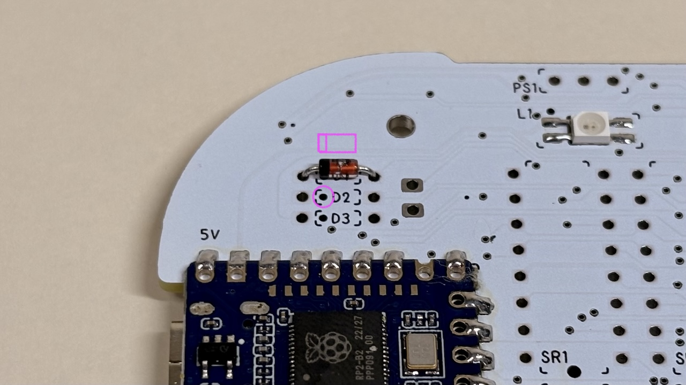

# Cannonball LL ([日本語](https://note.com/taro_hayashi/n/n3da1e116aa8d))

  

## 1 Introduction

### 1.1 Contents

  
  

|     | Types                  | Quantities |               |
| --- | ---------------------- | ---------- | ------------- |
| 1   | PCB                    | 1          |               |
| 2   | Runner I               | 1          |               |
| 3   | Runner II              | 1          |               |
| 4   | Top cover              | 1          |               |
| 5   | Knob cover             | 1          |               |
| 6   | Short screws           | 2          | M2 6mm        |
| 7   | Long screws            | 4          | M2 10mm       |
| 8   | Nuts                   | 4          | M2            |
| 9   | Insert nuts            | 2          | M2 5mm or 6mm |
| 10  | Diodes                 | 24         | 1N4148        |
| 11  | Capacitors             | 2          | 0.1uF         |
| 12  | Shift registers        | 2          | 74HC595       |
| 13  | back buttons           | 3          | 3x6x4.3       |
| 14  | Side buttons           | 4          | 3x6x5         |
| 15  | Slide switch           | 1          | SK12F14       |
| 16  | Mouse buttons          | 2          | YD-003        |
| 17  | Lever buttons          | 2          | THMU27        |
| 18  | Rotary Encoder         | 1          | RKJXT1F42001  |
| 19  | Rubber feet            | 5          |               |
| 20  | Pin header             | 1          | 40pins        |
| 21  | Pin Sockets            | 2          | 14pins        |
| 22  | Hotswap Sockets        | 10         | CPG151101S11  |
| 23  | 1U Wheel Encoder       | 2          | THQWGD001C    |
| 24  | Micro Controller Board | 1          | RP2040-Zero   |

### 1.2 Additional Required

  

| Types              | Quantities  |
| ---------------- | --- |
| Keyswitches      | 10  |
| Keycaps          | 10  |
| Type-C USB cable | 1   |

### 1.3 Optional

The items described here require some prerequisite knowledge for use. See the guide below for more information on going wireless.
- [Cannonball LL(wireless version)](BLE.md)

| Types                    | Quantitie  |                                                                                             |
| ---------------------- | --- | --------------------------------------------------------------------------------------------- |
| SK-6812MINI-E          | 14  |                                                                                               |
| Choc V1/V2 keyswitches | 10  | Height can be reduced. Sockets and top plates are not used. It cannot coexist with MX switches.                                   |
| Tape or glue           | 1   | When using Choc switches, isolate the head of the pin header to prevent unexpected operation. |
| [3-keys blocker](stl/)           | 1   | Blocks the palm of the hand when held. |
| [Switch plate](stl/)           | 1   | 3DP switch plate with invisible pin header heads. |

### 1.4 Tools required

  

| Types                                                | 
| --------------------------------------------------- |
| Soldering iron                                               |
| Trowel                     |
| Soldering wire |
| Nipper                     | 
| Cutter                    |
| File                      | 
| Twezers                    |   
| screwdriver                 | 

### 1.5 Tools optional

| Types                               | 
| --------------------------------- | 
| C-type trowel tip                             | 
| flux|                    |
| IPA                               | 
| Heat-resistant mat                             | 
| Tester                              |
| Desoldering wire                         | 
| Design Knife                           |
| Masking tape                          | 

## 2  Preparation for assembly

### 2.1 Disconnect the mainboard

It can be split cleanly by cutting a slit with a cutter and bending it.
  
The tabs are cut away with nippers and the cut surfaces are sanded. Be careful not to remove the original board edges, as over-shaving will damage the circuitry.
  
This area can be left jagged without affecting the finished form.
  
It could be divided into three parts: main board #1, main board #2 and switch plate.
  

### 2.2 Remove parts from the runner

Runner I has 3 components and runner II has 17 components.
  

### 2.3 Remove the shift register and rotary encoder from the case

The shift register is pressed from the back with the runner II component (leverage). Be careful not to prick your finger with the pin.
For the rotary encoder, cut the left and right claws with nippers.

### 2.4 Write test firmware

Download the uf2 file here.

- [tarohayashi_cannonballll_test.uf2](https://github.com/Taro-Hayashi/Cannonball-LL/releases/latest/download/tarohayashi_cannonballll_test.uf2)

Connect to the PC via USB cable while pressing the BOOT button.
  
Drag and drop the uf2 file as it is recognised as an RPI-RP2 drive.

It will now be recognised as a keyboard.

### 2.5 Press fitting of insert nuts

Press-fit the insert nut into the printed item in the image. Main board #1 is also used.
  
Apply main board #1 to the backside and press the soldering iron onto the insert nut.
  
Ensure as few steps as possible with main board #1.
  
Cut out the reinforcement with nippers.
  

## 3 Soldering of main board #️1

### 3.1 Be careful when soldering

Imagine molten solder spreading only on the pad due to surface tension. It is very easy to apply flux.
  
Heat the pads and component legs well to allow electricity to pass through both the board and the components.
Be careful that the solder does not connect with the small holes (VIA).
  
Take care that the legs coming out of the through-hole component are around 2 mm; if they exceed 2.5 mm, they may interfere with the 3D printed item on the bottom.
It is easier to fix them with masking tape after insertion and soldering.
  
Also, the melting point of 3D printed products is around 200°C. Be careful not to melt the soldering iron if it comes into direct contact with it.

### 3.2 Soldering the RP2040-Zero

Check the reverse side at 5V, GP0 and solder the 8 positions at the front once aligned using the pin headers supplied with the RP2040-Zero. Place a runner with the parts cut off underneath for stability.
  
Once the other side is also soldered, remove the pin headers and solder the remaining five positions.
  

### 3.3 (Optional) Soldering the SK6812MINI-E

Solder L1 to L4, aligning the mark with the missing direction.
  
The luminous surface is facing you.
  

### 3.4 Soldering of diodes

The diode has a direction. Align the mark with the direction of the black line.
  
Insert the diode into D1, turn it over, solder it and cut the legs with nippers.
  
Solder 7 places up to D7.
  
Leave one leg.
  

### 3.5 Soldering of shift registers

Insert the legs into SR1 and SR2 without breaking them, and solder them after checking that all the legs are sticking out from the back.
Align the circle mark with the direction of the chip on the package.
  

### 3.6  Soldering of capacitors

Solder to C1 and C2.
Make sure it says 104. If it is not, this is a packaging error and this step should be skipped. The capacitor will work without it.
  

### 3.7 Soldering side buttons and slide switches

Plug and solder the four side buttons SS1 to SS4 and one slide switch to SL.
  

### 3.8 Jumper short circuit
Bend the legs of the diode you have taken away into a U-shape.
  
Short-circuit JP/LP next to the slide switch.
  

### 3.9 Soldering of back buttons

The back button is inserted from the backside.
  

### 3.10  Confirmation of operation

Connect to a PC via USB cable and check the operation of the side and rear buttons; if 8 continues to be entered, switch the slide switch.
  
After checking, disconnect the cable. Soldering with the power on may cause a fault.

### 3.11 Soldering of pin sockets

Cut out eight pin sockets and pin headers with three pins each.
  
Insert the short end of the pin header into the pin socket and place the pin socket side on main board #1.
  
Insert the six Runner II components. If they are difficult to insert, shave off the cut marks on the pin headers or pin sockets.
  
Cover the main board #2 with the pin headers (do not solder yet). If it is difficult to get all the pin headers through, force a few at a time to avoid rubbing the board.
  
Once flipped over, solder the pin socket to main board #1.
  
After soldering is complete, return to the front and remove main board #2.
Printed items do not need to be removed.
  
If mainboard #2 has been soldered in place, use leverage to remove it. Be aware that if the pin header is bent, it may cause poor contact, so pull it out vertically.
  
テスターがある場合はRP2040-Zero、シフトレジスターのGPIOとピンヘッダーが導通していることを確認します。
  
## 3.12 下半分の組み立て
ランナーIの部品を組み合わせ、ランナーIIの部品を5個置きます。中央の部品の向きに気をつけます。
  
上からメインボード#1を置き、ランナーIの角の部品の一つにナットを取り付けます。
  
合計9個のランナーIの部品と4つのナットを取り付けました。
  
## 4 メインボード#2のはんだ付け

### 4.1（オプション）SK6812MINI-Eのはんだ付け
L5からL14にはんだ付けします。メインボード#2では発光面が反対側に向きます。
  
### 4.2 ダイオードのはんだ付け
D8からD24までをはんだ付けします。D19以降は取り付ける面が違います。
  
  
### 4.3 MXソケットのはんだ付け
S1からS10まではんだ付けします。ソケットには必要なはんだの量が多めです。
  
### 4.4  レバーボタンのはんだ付け
L1、L2に取り付けます。側面にも接点があるのではんだ付けします。
  
### 4.5 マウスボタンのはんだ付け
M1、M2に取り付けます。クリックバーの位置をシルク印刷に合わせます。
  
### 4.6  1Uホイールエンコーダーの組み立て
小袋の部品のうち以下のものを使用します。
  

|     | 部品名        | 個数  |               |
| --- | ---------- | --- | ------------- |
| 1   | ホイール       | 2   |               |
| 2   | シャフト       | 2   |               |
| 3   | スペーサー      | 2   |               |
| 4   | ベース        | 2   |               |
| 5   | カバー        | 2   |               |
| 6   | ホイールエンコーダー | 2   | 6x6x7         |
| 7   | クリックボタン    | 2   | 11mm          |
| 8   | ネジ（小)    | 4   | M2 5mm or 6mm |
| 9   | ナット        | 4   | M2            |

E1とE2に、方向を選んでクリックボタンとホイールエンコーダーをはんだ付けします。ビルドガイドでは画像の向きにしました。
  
ホイールの平らな面からシャフトを差し込みます。
  
エンコーダーにホイールを取り付けます。六角形の穴と六角形の軸が合うようにします。
  
スペーサーを取り付けてタクトスイッチに乗せます。
  
ベースをネジとナットで取り付けます。
  
カバーを取り付けます。
  
### 4.7 ロータリーエンコーダーのはんだ付け
STにはんだ付けします。
  
### 4.8 トップカバーの取り付け
裏面からネジ（短）で取り付けます。
  
マウスボタンがクリック可能なことを確認します。
  
### 4.9 ピンヘッダのはんだ付け
改めてメインボード#2の部品の向き、はんだ付けの状態を確認します。
問題がなさそうだったらメインボード#1に乗せてピンヘッダをはんだ付けします。
  
隙間をできるだけ減らすようにしながら角のピンヘッダから一つずつ作業をすると綺麗に出来上がります。
### 4.10 動作確認
ロータリーエンコーダーにランナーIについていたシャフトを取り付けます。
  
PCに接続して動作を確認します。キースイッチを一つ使ってソケットの動作を確認していきます。キースイッチの足が折れないように気をつけてください。
  
動作を確認したらUSBケーブルを取り外します。
### 4.11 スイッチプレートを取り付ける
メインボード#2とスイッチプレートの位置を合わせてキースイッチを取り付けます。
  
10個全て取り付けたらゴム足を付けます。
  
キーキャップとノブカバーを取り付けたら完成です。
  
ここからはPCを使った作業になります。
## 5 カスタマイズ

### 5.1 Remap対応ファームウェアに更新する
こちらのuf2ファイルをダウンロードします。
- [tarohayashi_cannonballll_default.uf2](https://github.com/Taro-Hayashi/Cannonball-LL/releases/latest/download/tarohayashi_cannonballll_default.uf2)

ホイールの間のキーを押しながらUSBケーブルでPCに接続するとRPI-RP2ドライブとして認識されます。無理だった場合は裏面の丸ボタンを押しながら接続してください。
  
RPI-RP2ドライブにuf2ファイルをドラッグ&ドロップをしたらRemap対応のファームウェアへの更新が完了です。

### 5.2 Remapでキーを入れ替える
Remapに接続してカスタマイズを選びます。
- remap https://remap-keys.app/
  
そのまま進んでCannonball LLを選びます。
  
下のキーリストからドラッグ&ドロップして、右上の書き込みボタンを押すとキーの入れ替えができます。
  
キーをクリックすると修飾キーとの同時押しの設定もできます。
### 5.2 ロータリーエンコーダーの設定
回転方向をクリックすると登録するキーを切り替えることができます。
  
先頭のロータリーエンコーダーの押し込みは無効になっています。
### 5.3 （オプション）LEDの調節
画像のアイコンから発光を調整できます。
  
### 5.4 特殊なキー
Remapに標準で用意されている機能のほか、Functions タブに特殊なショートカットや設定用のキーがあります。
  

| キー名         | キーコード      | 詳細                                    |
| ----------- | ---------- | ------------------------------------- |
| Cmd / Ctrl  | CMD_CTL    | Control（Windows） / Command（MacOS、iOS） |
| Undo        | UNDO       | Cmd / Ctrl + Z                        |
| Redo        | REDO       | Cmd / Ctrl + Shift + Z                |
| Copy        | COPY       | Cmd / Ctrl + C                        |
| Cut         | CUT        | Cmd / Ctrl + X                        |
| Paste       | PASTE      | Cmd / Ctrl + V                        |
| Scale Up    | SC_UP      | Cmd / Ctrl + +                        |
| Scale Down  | SC_DOWN    | Cmd / Ctrl + -                        |
| Scale Reset | SC_RESET   | Cmd / Ctrl + 0                        |
| Captcha     | CAPTCHA    | Win + Shift + 4 / Command + Shift + 4 |
| Save        | SAVE       | Cmd / Ctrl + S                        |
| Save As     | SAVEAS     | Cmd / Ctrl + Shift + S                |
| Close Tab   | CLOSETAB   | Cmd / Ctrl + W                        |
| Restore Tab | RSTRTAB    | Cmd / Ctrl + Shift + T                |
| Next App    | NEXTAPP    | Cmd / Ctrl +                          |
| Prev App    | PREVAPP    | Cmd / Ctrl +                          |
| RGB Layers  | RGB_LAYERS | LEDの色をレイヤーごとに変える機能のオン/オフ              |

## 6 その他

### 6.1 メンテナンス
ノブが緩くなったり1Uホイールエンコーダーのカバーが外れやすい場合ははんだごてで溶かすことで調節、固定することができます。
上下の締結にゆるみが出たり接触が悪くなった場合はピンヘッダとピンソケットの交換を検討してください。
### 6.2 プリント品のプリント用データ
オプションのパーツや色を変えたパーツを印刷できます。
- [STL.md](STL.md)
### 6.3 ファームウェアのコード
- [keyboards/tarohayashi/cannonballll(GitHub)](https://github.com/Taro-Hayashi/qmk_firmware/tree/tarohayashi/keyboards/tarohayashi/cannonballll)
### 6.4 保守品の入手先

| 部品名          | 型番            | 入手先の例                                                                                                                    |
| ------------ | ------------- | ------------------------------------------------------------------------------------------------------------------------ |
| ネジ（短)      | M2 5~6mm      | [遊舎工房](https://shop.yushakobo.jp/products/a0800t2?variant=37665432699041)、[モノタロウ](https://www.monotaro.com/p/2902/1476/) |
| ネジ（長)      | M2 10mm       | [遊舎工房](https://shop.yushakobo.jp/products/a0800t2?variant=43940945166567)、[モノタロウ](https://www.monotaro.com/p/2902/1494)|
| ナット          | M2            | [遊舎工房](https://shop.yushakobo.jp/products/4094)、[モノタロウ](https://www.monotaro.com/g/06150311)                           |
| インサートナット     | M2 5mm or 6mm | [モノタロウ](https://www.monotaro.com/p/4210/7484/)                                                                         |
| ダイオード        | 1N4148        | [遊舎工房](https://shop.yushakobo.jp/products/a0800di-01-100)、[秋月電子通商](https://akizukidenshi.com/catalog/g/g100941/)       |
| コンデンサー       | 0.1uF         | [秋月電子通商](https://akizukidenshi.com/catalog/g/g100090/)                                                                 |
| シフトレジスター     | 74HC595       | [秋月電子通商](https://akizukidenshi.com/catalog/g/g114053/)                                                                 |
| 背面ボタン        | 3x6x4.3       | [秋月電子通商](https://akizukidenshi.com/catalog/g/g108073/)                                                                 |
| 側面ボタン        | 3x6x5         | [秋月電子通商](https://akizukidenshi.com/catalog/g/g114890/)                                                                 |
| スライドスイッチ     | SK12F14       | [秋月電子通商](https://akizukidenshi.com/catalog/g/g115703/)（同型、要加工)                                                         |
| マウスボタン       | YD-003        | [秋月電子通商](https://akizukidenshi.com/catalog/g/g114312/)（同型、未検証)                                                         |
| レバーボタン       | TMHU27        | [秋月電子通商](https://akizukidenshi.com/catalog/g/g108071/)（同型、未検証)                                                         |
| ロータリーエンコーダー  | RKJXT1F42001  | [マルツ電子](https://www.marutsu.co.jp/pc/i/2578366/)                                                                       |
| ゴム足          |               | [遊舎工房](https://shop.yushakobo.jp/products/a0800ur-01-6)                                                                |
| ピンヘッダー       | 40ピン          | [秋月電子通商](https://akizukidenshi.com/catalog/g/g100167/)                                                                 |
| ピンソケット       | 14ピン          | [秋月電子通商](https://akizukidenshi.com/catalog/g/g103138/)                                                                 |
| MXソケット       | CPG151101S11  | [遊舎工房](https://shop.yushakobo.jp/products/a01ps)                                                                       |
| 1Uホイールエンコーダー | THQWGD001C    | [BOOTH](https://tarohayashi.booth.pm/items/5967252)                                                                    |
| マイコンボード      | RP2040-Zero   | [スイッチサイエンス](https://www.switch-science.com/products/7886/)                                                             |

### 6.5 販売サイト
- BOOTH - [https://tarohayashi.booth.pm/items/6736492](https://tarohayashi.booth.pm/items/6736492 "商品ページを見る")
