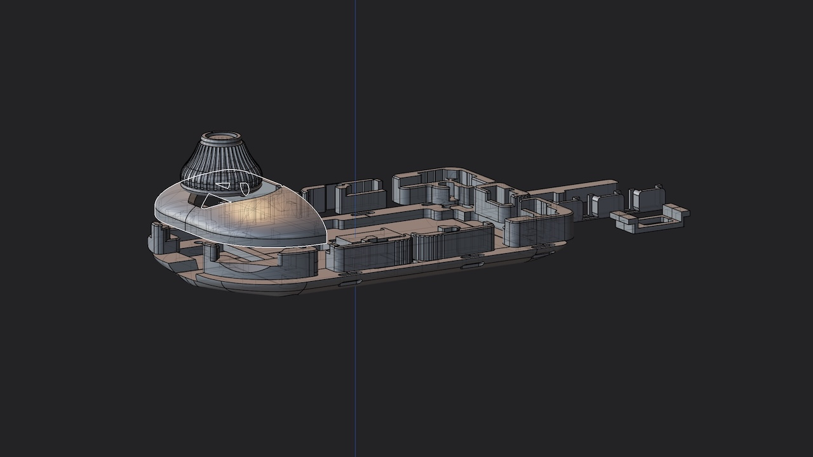
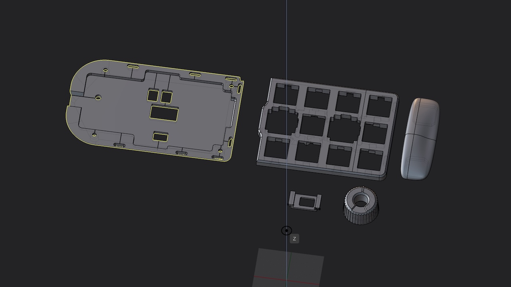

# Data for 3D Printing(GitHub)

## Included parts

| File name         |
| ----------------- |
| Bottom #1,2       |
| Side #1 - #9      |
| Top cover         |
| Shaft             |
| Knob              |
| Bottom button     |
| Reset button      |
| leverage          |
| Sensor cover #1,2 |
| Blocker           |

## 1U Wheel Encoder THQWGD001
- https://github.com/Taro-Hayashi/THQWGD001

## Optional parts

| File name      |
| -------------- |
| Switch plate   |
| 3-Keys Blocker |
| Mech knob      |
| integrated Bottom            |
| integrated Sensor cover      |
